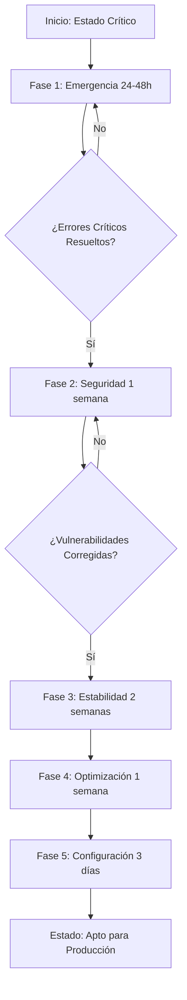
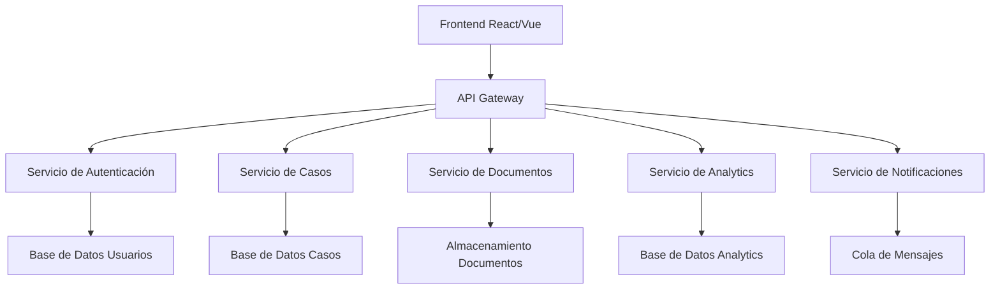
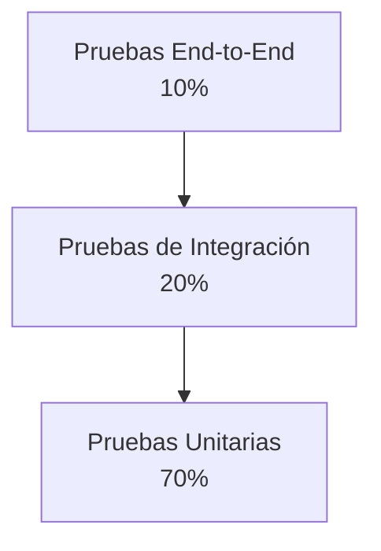
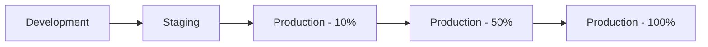

# 🚀 Plan de Acción Estratégico - Corrección de Errores Justice 2

**Fecha:** 8 de diciembre de 2024  
**Versión:** 1.0  
**Estado:** 🔄 PLAN ESTRATÉGICO PARA IMPLEMENTACIÓN INMEDIATA  
**Alcance:** 47 errores identificados en 5 categorías principales

---

## 📋 Índice

1. [Resumen Ejecutivo](#resumen-ejecutivo)
2. [Matriz de Priorización](#matriz-de-priorización)
3. [Plan de Corrección por Fases](#plan-de-corrección-por-fases)
   - [Fase 1: Emergencia (24-48 horas)](#fase-1-emergencia-24-48-horas)
   - [Fase 2: Seguridad (1 semana)](#fase-2-seguridad-1-semana)
   - [Fase 3: Estabilidad (2 semanas)](#fase-3-estabilidad-2-semanas)
   - [Fase 4: Optimización (1 semana)](#fase-4-optimización-1-semana)
   - [Fase 5: Configuración (3 días)](#fase-5-configuración-3-días)
4. [Recomendaciones Técnicas Específicas](#recomendaciones-técnicas-específicas)
5. [Plan de Implementación](#plan-de-implementación)
6. [Métricas de Éxito](#métricas-de-éxito)
7. [Anexos](#anexos)

---

## 📊 Resumen Ejecutivo

La aplicación Justice 2 presenta **47 errores críticos** que comprometen la seguridad, funcionalidad y rendimiento del sistema. El estado actual es **NO APTO PARA PRODUCCIÓN** y requiere intervención inmediata.

### Estadísticas Clave
- **Errores Críticos:** 8 (requieren corrección en 24-48 horas)
- **Vulnerabilidades de Seguridad:** 12 (alto riesgo de exposición de datos)
- **Errores de Lógica:** 15 (afectan funcionalidad principal)
- **Problemas de Rendimiento:** 7 (degradan experiencia de usuario)
- **Errores de Configuración:** 5 (impiden despliegue correcto)

### Impacto de Negocio
- **Riesgo de Seguridad:** 🔴 Crítico - Posible exposición de datos sensibles
- **Disponibilidad:** 🟠 Baja - Múltiples puntos de fallo
- **Experiencia de Usuario:** 🟡 Degradada - Errores en funcionalidades clave
- **Mantenibilidad:** 🔴 Crítica - Deuda técnica alta

---

## 🎯 Matriz de Priorización

| Categoría | Cantidad | Prioridad | Tiempo Estimado | Impacto en Negocio |
|-----------|----------|-----------|-----------------|-------------------|
| 🚨 Errores Críticos | 8 | Inmediata | 24-48 horas | Crítico |
| 🔒 Errores de Seguridad | 12 | Alta | 1 semana | Crítico |
| ⚙️ Errores de Configuración | 5 | Alta | 3 días | Alto |
| 🧠 Errores de Lógica | 15 | Media | 2 semanas | Medio |
| ⚡ Errores de Rendimiento | 7 | Media | 1 semana | Medio |

### Diagrama de Flujo de Implementación



---

## 📅 Plan de Corrección por Fases

## 🚨 Fase 1: Emergencia (24-48 horas)

### Objetivo
Corregir los 8 errores críticos que comprometen la seguridad y estabilidad básica del sistema.

### Lista de Errores Críticos por Orden de Prioridad

#### 1.1 🔐 Credenciales de Base de Datos Expuestas
- **Archivo:** [`.env`](.env:1)
- **Prioridad:** 1 (Máxima)
- **Tiempo Estimado:** 2 horas
- **Dependencias:** Ninguna

**Pasos de Corrección:**
1. Mover credenciales a variables de entorno seguras
2. Implementar gestor de secretos (AWS Secrets Manager o similar)
3. Rotar credenciales actuales
4. Configurar conexión SSL/TLS

**Código de Ejemplo:**
```javascript
// .env.production
DATABASE_URL=${DATABASE_URL}
DB_HOST=${DB_HOST}
DB_USER=${DB_USER}
DB_PASSWORD=${DB_PASSWORD}
DB_NAME=${DB_NAME}
SSL_MODE=require
```

#### 1.2 💥 Referencia No Definida en Sistema de Notificaciones
- **Archivo:** [`js/justice2-api.js`](js/justice2-api.js:539)
- **Prioridad:** 2
- **Tiempo Estimado:** 1 hora
- **Dependencias:** Ninguna

**Pasos de Corrección:**
1. Verificar importación del sistema de notificaciones
2. Implementar fallback para manejo de errores
3. Añadir validación de existencia antes de uso

**Código de Ejemplo:**
```javascript
// Corrección en js/justice2-api.js:539
if (typeof NotificationSystem !== 'undefined' && NotificationSystem.showError) {
    NotificationSystem.showError('Error SSL: ' + error.message);
} else {
    console.error('Error SSL:', error.message);
    // Fallback simple
    alert('Error de conexión: ' + error.message);
}
```

#### 1.3 🛡️ Validación de Token Inexistente
- **Archivo:** [`js/justice2-auth.js`](js/justice2-auth.js:511-523)
- **Prioridad:** 3
- **Tiempo Estimado:** 3 horas
- **Dependencias:** Ninguna

**Pasos de Corrección:**
1. Implementar método `validateToken()` completo
2. Añadir validación de estructura JWT
3. Implementar renovación automática de tokens

**Código de Ejemplo:**
```javascript
// Implementación en js/justice2-auth.js
validateToken(token) {
    try {
        if (!token) return false;
        
        const decoded = jwt.decode(token);
        if (!decoded || !decoded.exp) return false;
        
        const now = Date.now() / 1000;
        if (decoded.exp < now) {
            this.refreshToken();
            return false;
        }
        
        return jwt.verify(token, this.getSecret());
    } catch (error) {
        console.error('Error validando token:', error);
        return false;
    }
}
```

#### 1.4 🧪 Inyección de Código (XSS)
- **Archivo:** [`js/documents.js`](js/documents.js:242)
- **Prioridad:** 4
- **Tiempo Estimado:** 2 horas
- **Dependencias:** Instalar DOMPurify

**Pasos de Corrección:**
1. Instalar biblioteca DOMPurify
2. Reemplazar innerHTML con sanitized content
3. Implementar política CSP

**Código de Ejemplo:**
```javascript
// Instalación: npm install dompurify
import DOMPurify from 'dompurify';

// Corrección en js/documents.js:242
const sanitizedContent = DOMPurify.sanitize(userContent);
document.getElementById('document-content').innerHTML = sanitizedContent;
```

#### 1.5 🔌 Configuración SSL Insegura
- **Archivo:** [`netlify/functions/api.js`](netlify/functions/api.js:17)
- **Prioridad:** 5
- **Tiempo Estimado:** 1 hora
- **Dependencias:** Certificado SSL válido

**Pasos de Corrección:**
1. Habilitar validación SSL
2. Configurar certificados válidos
3. Implementar verificación de cadena de certificados

**Código de Ejemplo:**
```javascript
// Corrección en netlify/functions/api.js:17
ssl: {
    rejectUnauthorized: true,
    cert: process.env.SSL_CERT,
    key: process.env.SSL_KEY,
    ca: process.env.SSL_CA
}
```

#### 1.6 🧪 Sistema de Pruebas No Funcional
- **Archivo:** [`automated-ssl-test.js`](automated-ssl-test.js:322)
- **Prioridad:** 6
- **Tiempo Estimado:** 4 horas
- **Dependencias:** Ninguna

**Pasos de Corrección:**
1. Corregir referencia al método de logging
2. Implementar contexto de ejecución adecuado
3. Añadir manejo de errores en pruebas

**Código de Ejemplo:**
```javascript
// Corrección en automated-ssl-test.js:322
class SSLTestRunner {
    constructor() {
        this.logs = [];
    }
    
    log(message) {
        this.logs.push({
            timestamp: new Date().toISOString(),
            message: message
        });
        console.log(message);
    }
    
    // ... resto del código
}

// Uso correcto:
this.log('Test completed: ' + testName);
```

#### 1.7 🧠 Memory Leak Crítico
- **Archivo:** [`js/justice2-integration.js`](js/justice2-integration.js:246)
- **Prioridad:** 7
- **Tiempo Estimado:** 2 horas
- **Dependencias:** Ninguna

**Pasos de Corrección:**
1. Implementar limpieza de intervalos
2. Añadir manejo de ciclo de vida
3. Monitorizar uso de memoria

**Código de Ejemplo:**
```javascript
// Corrección en js/justice2-integration.js:246
class IntegrationManager {
    constructor() {
        this.intervals = [];
    }
    
    startStatusCheck() {
        const intervalId = setInterval(() => {
            this.checkStatus();
        }, 5000);
        this.intervals.push(intervalId);
    }
    
    cleanup() {
        this.intervals.forEach(intervalId => {
            clearInterval(intervalId);
        });
        this.intervals = [];
    }
    
    // Llamar a cleanup() cuando el componente se destruye
}
```

#### 1.8 🔑 Autenticación Débil con JWT
- **Archivo:** [`netlify/functions/api.js`](netlify/functions/api.js:20)
- **Prioridad:** 8
- **Tiempo Estimado:** 1 hora
- **Dependencias:** Variables de entorno

**Pasos de Corrección:**
1. Generar JWT_SECRET seguro y aleatorio
2. Mover a variables de entorno
3. Implementar rotación de secretos

**Código de Ejemplo:**
```javascript
// Corrección en netlify/functions/api.js:20
const JWT_SECRET = process.env.JWT_SECRET || crypto.randomBytes(64).toString('hex');

// En .env.production
JWT_SECRET=tu_secreto_aleatorio_muy_largo_y_seguro_aqui
```

### Recursos Necesarios para Fase 1
- **Personal:** 2 desarrolladores senior
- **Herramientas:** Gestor de secretos, biblioteca DOMPurify
- **Tiempo Total:** 16 horas (2 días laborables)
- **Riesgos:** Posible downtime durante implementación

---

## 🔒 Fase 2: Seguridad (1 semana)

### Objetivo
Corregir las 12 vulnerabilidades de seguridad para proteger datos sensibles y prevenir accesos no autorizados.

### Lista de Errores de Seguridad por Orden de Prioridad

#### 2.1 🧹 Sanitización Incompleta
- **Archivo:** [`components/utils.js`](components/utils.js:206-211)
- **Prioridad:** 1
- **Tiempo Estimado:** 4 horas
- **Dependencias:** DOMPurify instalado

**Pasos de Corrección:**
1. Implementar sanitización completa con DOMPurify
2. Añadir validación de contenido permitido
3. Crear lista blanca de tags seguros

**Código de Ejemplo:**
```javascript
// Mejora en components/utils.js
import DOMPurify from 'dompurify';

function sanitize(input, options = {}) {
    const defaultOptions = {
        ALLOWED_TAGS: ['p', 'br', 'strong', 'em', 'ul', 'ol', 'li'],
        ALLOWED_ATTR: ['class', 'id']
    };
    
    return DOMPurify.sanitize(input, { ...defaultOptions, ...options });
}
```

#### 2.2 💬 Renderizado de Mensajes Sin Sanitización
- **Archivo:** [`js/ai-assistant.js`](js/ai-assistant.js:147)
- **Prioridad:** 2
- **Tiempo Estimado:** 2 horas
- **Dependencias:** DOMPurify

**Pasos de Corrección:**
1. Sanitizar todas las respuestas del asistente
2. Implementar validación de contenido
3. Añadir modo seguro para usuarios no verificados

#### 2.3 🔐 Manejo Inadecuado de Contraseñas
- **Archivo:** [`netlify/functions/api.js`](netlify/functions/api.js:62-64)
- **Prioridad:** 3
- **Tiempo Estimado:** 6 horas
- **Dependencias:** bcrypt, políticas de contraseña

**Pasos de Corrección:**
1. Implementar hashing con bcrypt
2. Añadir políticas de complejidad
3. Implementar límite de intentos

**Código de Ejemplo:**
```javascript
// Implementación en netlify/functions/api.js
const bcrypt = require('bcrypt');
const rateLimit = require('express-rate-limit');

const loginLimiter = rateLimit({
    windowMs: 15 * 60 * 1000, // 15 minutos
    max: 5, // límite de 5 intentos
    message: 'Demasiados intentos de inicio de sesión'
});

async function validatePassword(plainPassword, hashedPassword) {
    return await bcrypt.compare(plainPassword, hashedPassword);
}

function validatePasswordStrength(password) {
    const minLength = 8;
    const hasUpperCase = /[A-Z]/.test(password);
    const hasLowerCase = /[a-z]/.test(password);
    const hasNumbers = /\d/.test(password);
    const hasSpecialChar = /[!@#$%^&*(),.?":{}|<>]/.test(password);
    
    return password.length >= minLength && 
           hasUpperCase && 
           hasLowerCase && 
           hasNumbers && 
           hasSpecialChar;
}
```

#### 2.4 👤 Usuario Demo con Privilegios de Admin
- **Archivo:** [`netlify/functions/api.js`](netlify/functions/api.js:45-54)
- **Prioridad:** 4
- **Tiempo Estimado:** 2 horas
- **Dependencias:** Ninguna

**Pasos de Corrección:**
1. Eliminar credenciales de demo en producción
2. Implementar validación de entorno
3. Crear sistema de roles apropiado

#### 2.5 🛡️ Protección CSRF No Implementada
- **Archivo:** [`js/justice2-config.js`](js/justice2-config.js:114)
- **Prioridad:** 5
- **Tiempo Estimado:** 8 horas
- **Dependencias:** csrf-token biblioteca

**Pasos de Corrección:**
1. Implementar generación de tokens CSRF
2. Añadir validación en todas las solicitudes POST
3. Configurar middleware CSRF

**Código de Ejemplo:**
```javascript
// Implementación CSRF
const csrf = require('csurf');
const cookieParser = require('cookie-parser');

app.use(cookieParser());
const csrfProtection = csrf({ cookie: true });

app.get('/api/csrf-token', csrfProtection, (req, res) => {
    res.json({ csrfToken: req.csrfToken() });
});

// En frontend
const csrfToken = await fetch('/api/csrf-token').then(res => res.json());

fetch('/api/data', {
    method: 'POST',
    headers: {
        'X-CSRF-Token': csrfToken.csrfToken,
        'Content-Type': 'application/json'
    },
    body: JSON.stringify(data)
});
```

#### 2.6 🚦 Rate Limiting Insuficiente
- **Archivo:** [`js/justice2-api.js`](js/justice2-api.js:642)
- **Prioridad:** 6
- **Tiempo Estimado:** 4 horas
- **Dependencias:** express-rate-limit

**Pasos de Corrección:**
1. Implementar rate limiting efectivo
2. Configurar límites diferenciados por tipo de usuario
3. Añadir monitoreo de intentos

#### 2.7 🔍 Exposición de Credenciales en Frontend
- **Archivo:** [`js/justice2-config.js`](js/justice2-config.js:84-88)
- **Prioridad:** 7
- **Tiempo Estimado:** 2 horas
- **Dependencias:** Ninguna

**Pasos de Corrección:**
1. Eliminar credenciales del frontend
2. Mover toda configuración de DB al backend
3. Implementar proxy para solicitudes de base de datos

#### 2.8 📎 Validación de Archivos Insuficiente
- **Archivo:** [`js/documents.js`](js/documents.js:302-323)
- **Prioridad:** 8
- **Tiempo Estimado:** 6 horas
- **Dependencias:** file-type, multer

**Pasos de Corrección:**
1. Implementar validación de tipo MIME real
2. Añadir verificación de extensión y contenido
3. Implementar escaneo de malware

**Código de Ejemplo:**
```javascript
// Validación de archivos mejorada
import fileType from 'file-type';
import multer from 'multer';

const fileFilter = async (req, file, cb) => {
    try {
        // Verificar extensión
        const allowedExtensions = ['.pdf', '.doc', '.docx', '.jpg', '.png'];
        const fileExtension = path.extname(file.originalname).toLowerCase();
        
        if (!allowedExtensions.includes(fileExtension)) {
            return cb(new Error('Tipo de archivo no permitido'), false);
        }
        
        // Verificar tipo MIME real
        const buffer = file.buffer;
        const type = await fileType.fromBuffer(buffer);
        
        const allowedMimes = [
            'application/pdf',
            'application/msword',
            'application/vnd.openxmlformats-officedocument.wordprocessingml.document',
            'image/jpeg',
            'image/png'
        ];
        
        if (!allowedMimes.includes(type.mime)) {
            return cb(new Error('Tipo de archivo no válido'), false);
        }
        
        cb(null, true);
    } catch (error) {
        cb(error, false);
    }
};
```

#### 2.9 💾 Token JWT Almacenado Inseguramente
- **Archivo:** [`js/justice2-auth.js`](js/justice2-auth.js:54-55)
- **Prioridad:** 9
- **Tiempo Estimado:** 4 horas
- **Dependencias:** Ninguna

**Pasos de Corrección:**
1. Implementar cookies HttpOnly y Secure
2. Añadir cifrado para almacenamiento local
3. Implementar renovación automática

#### 2.10 ⏰ Manejo Inadecuado de Expiración de Sesiones
- **Archivo:** [`js/justice2-auth.js`](js/justice2-auth.js:511-523)
- **Prioridad:** 10
- **Tiempo Estimado:** 3 horas
- **Dependencias:** Ninguna

**Pasos de Corrección:**
1. Corregir lógica de expiración
2. Implementar renovación proactiva
3. Añadir logout automático por inactividad

#### 2.11 💉 Inyección SQL Posible
- **Archivo:** [`netlify/functions/api.js`](netlify/functions/api.js:56, 88)
- **Prioridad:** 11
- **Tiempo Estimado:** 6 horas
- **Dependencias:** pg, query builder

**Pasos de Corrección:**
1. Implementar consultas parametrizadas
2. Usar ORM o query builder
3. Añadir validación de entradas

**Código de Ejemplo:**
```javascript
// Corrección de inyección SQL
const { Pool } = require('pg');

// Forma incorrecta (vulnerable):
// const query = `SELECT * FROM users WHERE username = '${username}'`;

// Forma correcta (parametrizada):
const query = 'SELECT * FROM users WHERE username = $1';
const values = [username];

const result = await pool.query(query, values);

// Usando Knex.js query builder:
const knex = require('knex')({
    client: 'pg',
    connection: process.env.DATABASE_URL
});

const user = await knex('users')
    .where('username', username)
    .first();
```

#### 2.12 🛡️ Falta de Encabezados de Seguridad
- **Archivo:** [`netlify.toml`](netlify.toml:12)
- **Prioridad:** 12
- **Tiempo Estimado:** 2 horas
- **Dependencias:** Ninguna

**Pasos de Corrección:**
1. Configurar headers de seguridad
2. Implementar CSP
3. Añadir HSTS y otros headers

**Código de Ejemplo:**
```toml
# Configuración en netlify.toml
[[headers]]
  for = "/*"
  [headers.values]
    X-Frame-Options = "DENY"
    X-XSS-Protection = "1; mode=block"
    X-Content-Type-Options = "nosniff"
    Referrer-Policy = "strict-origin-when-cross-origin"
    Content-Security-Policy = "default-src 'self'; script-src 'self' 'unsafe-inline'; style-src 'self' 'unsafe-inline'; img-src 'self' data: https:; font-src 'self'; connect-src 'self'"
    Strict-Transport-Security = "max-age=31536000; includeSubDomains"
```

### Recursos Necesarios para Fase 2
- **Personal:** 2 desarrolladores senior, 1 especialista en seguridad
- **Herramientas:** bcrypt, csurf, express-rate-limit, file-type, knex
- **Tiempo Total:** 49 horas (1 semana)
- **Riesgos:** Posible impacto en funcionalidad existente

---

## 🧠 Fase 3: Estabilidad (2 semanas)

### Objetivo
Corregir los 15 errores de lógica que afectan la funcionalidad principal y causan comportamiento inesperado.

### Lista de Errores de Lógica por Orden de Prioridad

#### 3.1 ⚖️ Comparación Loose Inadecuada
- **Archivo:** [`js/justice2-mock-data.js`](js/justice2-mock-data.js:79)
- **Prioridad:** 1
- **Tiempo Estimado:** 4 horas
- **Dependencias:** Ninguna

**Pasos de Corrección:**
1. Reemplazar todas las comparaciones `==` con `===`
2. Implementar validación de tipos
3. Añadir pruebas unitarias para validación

**Código de Ejemplo:**
```javascript
// Corrección en js/justice2-mock-data.js:79
// Incorrecto:
if (userType == 'admin') {
    // lógica vulnerable
}

// Correcto:
if (userType === 'admin') {
    // lógica segura
}

// Validación adicional:
function validateUserType(userType) {
    const validTypes = ['admin', 'lawyer', 'assistant', 'client'];
    return validTypes.includes(userType) ? userType : null;
}
```

#### 3.2 🎯 Variable de Evento No Definida
- **Archivo:** [`js/cases.js`](js/cases.js:812)
- **Prioridad:** 2
- **Tiempo Estimado:** 2 horas
- **Dependencias:** Ninguna

**Pasos de Corrección:**
1. Añadir parámetro event a la función
2. Implementar validación de contexto
3. Añadir manejo de errores

#### 3.3 ✅ Validación de Datos Incompleta
- **Archivo:** [`js/cases.js`](js/cases.js:676-736)
- **Prioridad:** 3
- **Tiempo Estimado:** 8 horas
- **Dependencias:** Joi o similar

**Pasos de Corrección:**
1. Implementar validación completa de campos
2. Añadir validación de tipos y formatos
3. Crear esquemas de validación

**Código de Ejemplo:**
```javascript
// Implementación con Joi
const Joi = require('joi');

const caseSchema = Joi.object({
    title: Joi.string().min(3).max(100).required(),
    description: Joi.string().min(10).max(2000).required(),
    clientId: Joi.number().integer().positive().required(),
    lawyerId: Joi.number().integer().positive().required(),
    caseType: Joi.string().valid('civil', 'criminal', 'corporate', 'family').required(),
    priority: Joi.string().valid('low', 'medium', 'high', 'urgent').required(),
    status: Joi.string().valid('open', 'in-progress', 'closed', 'archived').default('open'),
    dueDate: Joi.date().greater('now').required(),
    documents: Joi.array().items(Joi.string()).optional()
});

function validateCaseData(caseData) {
    const { error, value } = caseSchema.validate(caseData);
    if (error) {
        throw new Error(`Validación fallida: ${error.details[0].message}`);
    }
    return value;
}
```

#### 3.4 🔄 Manejo de Promesas Incorrecto
- **Archivo:** [`js/justice2-integration.js`](js/justice2-integration.js:485)
- **Prioridad:** 4
- **Tiempo Estimado:** 3 horas
- **Dependencias:** Ninguna

**Pasos de Corrección:**
1. Implementar método `handleAuthError()`
2. Añadir manejo robusto de errores
3. Implementar retry con backoff

#### 3.5 🔄 Actualización Automática Sin Control
- **Archivo:** [`js/justice2-core.js`](js/justice2-core.js:475)
- **Prioridad:** 5
- **Tiempo Estimado:** 4 horas
- **Dependencias:** Ninguna

**Pasos de Corrección:**
1. Implementar control de estado
2. Añadir condiciones para actualizaciones
3. Implementar actualizaciones basadas en eventos

#### 3.6 💾 Lógica de Caché Problemática
- **Archivo:** [`js/justice2-api.js`](js/justice2-api.js:713-730)
- **Prioridad:** 6
- **Tiempo Estimado:** 6 horas
- **Dependencias:** Redis o similar

**Pasos de Corrección:**
1. Implementar estrategia de invalidación
2. Añadir verificación de frescura
3. Implementar caché distribuida

#### 3.7 🌐 Manejo Inadecuado de Errores de Red
- **Archivo:** [`js/ai-assistant.js`](js/ai-assistant.js:219-225)
- **Prioridad:** 7
- **Tiempo Estimado:** 3 horas
- **Dependencias:** Ninguna

**Pasos de Corrección:**
1. Implementar manejo robusto de errores
2. Añadir retroalimentación al usuario
3. Implementar modo offline

#### 3.8 📝 Validación de Formularios Incompleta
- **Archivo:** [`js/documents.js`](js/documents.js:302-323)
- **Prioridad:** 8
- **Tiempo Estimado:** 4 horas
- **Dependencias:** Joi o validación personalizada

**Pasos de Corrección:**
1. Implementar validación completa
2. Añadir validación en tiempo real
3. Implementar mensajes de error específicos

#### 3.9 📄 Lógica de Paginación con Errores
- **Archivo:** [`js/analytics.js`](js/analytics.js:630-640)
- **Prioridad:** 9
- **Tiempo Estimado:** 3 horas
- **Dependencias:** Ninguna

**Pasos de Corrección:**
1. Implementar lógica robusta de paginación
2. Añadir validación de límites
3. Implementar navegación intuitiva

#### 3.10 🔄 Manejo Inconsistente de Estados de Carga
- **Archivo:** [`js/justice2-dynamic.js`](js/justice2-dynamic.js:80-106)
- **Prioridad:** 10
- **Tiempo Estimado:** 4 horas
- **Dependencias:** Ninguna

**Pasos de Corrección:**
1. Implementar manejo consistente
2. Añadir estados intermedios
3. Implementar indicadores visuales

#### 3.11 🔄 Lógica de Sincronización con Pérdida de Datos
- **Archivo:** [`js/justice2-integration.js`](js/justice2-integration.js:252-296)
- **Prioridad:** 11
- **Tiempo Estimado:** 8 horas
- **Dependencias:** Implementación de cola de mensajes

**Pasos de Corrección:**
1. Implementar sincronización robusta
2. Añadir mecanismos de recuperación
3. Implementar validación de integridad

#### 3.12 📊 Error de Validación de Tipos
- **Archivo:** [`js/analytics.js`](js/analytics.js:524)
- **Prioridad:** 12
- **Tiempo Estimado:** 2 horas
- **Dependencias:** Ninguna

**Pasos de Corrección:**
1. Implementar validación de tipos
2. Añadir conversión segura
3. Implementar manejo de valores nulos

#### 3.13 🔄 Manejo Inseguro de Callbacks
- **Archivo:** [`components/notification-system.js`](components/notification-system.js:324-330)
- **Prioridad:** 13
- **Tiempo Estimado:** 3 horas
- **Dependencias:** Ninguna

**Pasos de Corrección:**
1. Implementar validación de callbacks
2. Añadir manejo de errores
3. Implementar timeout para callbacks

#### 3.14 🔄 Lógica de Retry con Bucles Infinitos
- **Archivo:** [`js/justice2-api.js`](js/justice2-api.js:645-665)
- **Prioridad:** 14
- **Tiempo Estimado:** 4 horas
- **Dependencias:** Ninguna

**Pasos de Corrección:**
1. Implementar backoff exponencial
2. Añadir límites estrictos
3. Implementar circuit breaker

#### 3.15 ⏰ Validación de Tiempo de Expiración Incorrecta
- **Archivo:** [`js/justice2-auth.js`](js/justice2-auth.js:62-64)
- **Prioridad:** 15
- **Tiempo Estimado:** 2 horas
- **Dependencias:** Ninguna

**Pasos de Corrección:**
1. Corregir lógica de tiempo
2. Implementar zona horaria consistente
3. Añadir tolerancia de reloj

### Recursos Necesarios para Fase 3
- **Personal:** 2 desarrolladores senior, 1 QA
- **Herramientas:** Joi, Redis, sistema de logging
- **Tiempo Total:** 60 horas (2 semanas)
- **Riesgos:** Posibles regresiones en funcionalidad existente

---

## ⚡ Fase 4: Optimización (1 semana)

### Objetivo
Corregir los 7 errores de rendimiento que degradan la experiencia del usuario y consumen recursos innecesarios.

### Lista de Errores de Rendimiento por Orden de Prioridad

#### 4.1 🧠 Memory Leaks Múltiples
- **Archivos:** Múltiples archivos con `setInterval` sin limpieza
- **Prioridad:** 1
- **Tiempo Estimado:** 8 horas
- **Dependencias:** Ninguna

**Pasos de Corrección:**
1. Identificar todos los memory leaks
2. Implementar limpieza de intervalos y eventos
3. Añadir monitoreo de memoria

**Código de Ejemplo:**
```javascript
// Gestor de memoria centralizado
class MemoryManager {
    constructor() {
        this.intervals = new Set();
        this.eventListeners = new Map();
        this.observers = new Set();
    }
    
    // Gestión de intervalos
    setInterval(callback, delay) {
        const id = setInterval(callback, delay);
        this.intervals.add(id);
        return id;
    }
    
    clearInterval(id) {
        clearInterval(id);
        this.intervals.delete(id);
    }
    
    // Gestión de event listeners
    addEventListener(element, event, handler) {
        element.addEventListener(event, handler);
        
        if (!this.eventListeners.has(element)) {
            this.eventListeners.set(element, []);
        }
        this.eventListeners.get(element).push({ event, handler });
    }
    
    removeEventListeners(element) {
        const listeners = this.eventListeners.get(element) || [];
        listeners.forEach(({ event, handler }) => {
            element.removeEventListener(event, handler);
        });
        this.eventListeners.delete(element);
    }
    
    // Limpieza completa
    cleanup() {
        // Limpiar intervalos
        this.intervals.forEach(id => clearInterval(id));
        this.intervals.clear();
        
        // Limpiar event listeners
        this.eventListeners.forEach((listeners, element) => {
            this.removeEventListeners(element);
        });
        
        // Limpiar observers
        this.observers.forEach(observer => observer.disconnect());
        this.observers.clear();
    }
}

// Uso global
const memoryManager = new MemoryManager();

// Antes de descargar la página
window.addEventListener('beforeunload', () => {
    memoryManager.cleanup();
});
```

#### 4.2 🔄 Actualización Automática Excesiva
- **Archivo:** [`js/justice2-core.js`](js/justice2-core.js:472)
- **Prioridad:** 2
- **Tiempo Estimado:** 4 horas
- **Dependencias:** Ninguna

**Pasos de Corrección:**
1. Implementar actualizaciones condicionales
2. Añadir detección de actividad del usuario
3. Implementar WebSocket para actualizaciones en tiempo real

#### 4.3 🎲 Generación Ineficiente de Datos Mock
- **Archivo:** [`js/justice2-mock-data.js`](js/justice2-mock-data.js:220-252)
- **Prioridad:** 3
- **Tiempo Estimado:** 6 horas
- **Dependencias:** Ninguna

**Pasos de Corrección:**
1. Optimizar algoritmos de generación
2. Implementar caché de datos mock
3. Añadir generación diferida

#### 4.4 🗄️ Consultas Ineficientes
- **Archivo:** [`netlify/functions/api.js`](netlify/functions/api.js:118-125)
- **Prioridad:** 4
- **Tiempo Estimado:** 8 horas
- **Dependencias:** Análisis de base de datos

**Pasos de Corrección:**
1. Analizar y optimizar consultas
2. Implementar índices apropiados
3. Añadir paginación y filtrado

**Código de Ejemplo:**
```javascript
// Optimización de consultas
// Antes (ineficiente):
const query = 'SELECT * FROM large_table WHERE condition = ?';

// Después (optimizado):
const query = `
    SELECT id, name, email, created_at 
    FROM users 
    WHERE active = true 
    AND last_login > $1 
    ORDER BY last_login DESC 
    LIMIT $2 OFFSET $3
`;

// Crear índices:
// CREATE INDEX idx_users_active_last_login ON users(active, last_login);
// CREATE INDEX idx_cases_status_priority ON cases(status, priority);
```

#### 4.5 📈 Renderizado Excesivo de Charts
- **Archivo:** [`js/analytics.js`](js/analytics.js:436-449)
- **Prioridad:** 5
- **Tiempo Estimado:** 6 horas
- **Dependencias:** Memoización

**Pasos de Corrección:**
1. Implementar renderizado diferencial
2. Añadir memoización de componentes
3. Implementar virtualización para grandes datasets

#### 4.6 💾 Estrategia de Caché Ineficiente
- **Archivo:** [`js/justice2-dynamic.js`](js/justice2-dynamic.js:672-682)
- **Prioridad:** 6
- **Tiempo Estimado:** 4 horas
- **Dependencias:** Redis o similar

**Pasos de Corrección:**
1. Implementar caché inteligente
2. Añadir invalidación automática
3. Implementar caché multinivel

#### 4.7 🎬 Animaciones Excesivas
- **Archivo:** [`js/justice2-dynamic.js`](js/justice2-dynamic.js:498-505)
- **Prioridad:** 7
- **Tiempo Estimado:** 3 horas
- **Dependencias:** Ninguna

**Pasos de Corrección:**
1. Optimizar animaciones con CSS
2. Implementar detección de capacidad del dispositivo
3. Añadir opción para reducir animaciones

### Recursos Necesarios para Fase 4
- **Personal:** 2 desarrolladores senior, 1 especialista en rendimiento
- **Herramientas:** Redis, herramientas de profiling
- **Tiempo Total:** 39 horas (1 semana)
- **Riesgos:** Posible impacto en experiencia de usuario durante optimización

---

## ⚙️ Fase 5: Configuración (3 días)

### Objetivo
Corregir los 5 errores de configuración que impiden el despliegue correcto y causan problemas operacionales.

### Lista de Errores de Configuración por Orden de Prioridad

#### 5.1 🎯 Punto de Entrada Incorrecto
- **Archivo:** [`package.json`](package.json:5)
- **Prioridad:** 1
- **Tiempo Estimado:** 1 hora
- **Dependencias:** Ninguna

**Pasos de Corrección:**
1. Identificar el archivo principal correcto
2. Actualizar package.json
3. Verificar configuración de inicio

**Código de Ejemplo:**
```json
// Corrección en package.json
{
  "name": "justice2",
  "version": "1.0.0",
  "main": "index.html",
  "scripts": {
    "start": "serve -s . -p 3000",
    "build": "npm run build:css && npm run build:js",
    "build:css": "postcss css/style.css -o css/style.min.css",
    "build:js": "webpack --mode production",
    "dev": "webpack-dev-server --mode development",
    "test": "jest",
    "test:watch": "jest --watch"
  }
}
```

#### 5.2 📝 Error de Sintaxis en Configuración
- **Archivo:** [`netlify.toml`](netlify.toml:7)
- **Prioridad:** 2
- **Tiempo Estimado:** 2 horas
- **Dependencias:** Ninguna

**Pasos de Corrección:**
1. Corregir sintaxis de redirecciones
2. Validar configuración completa
3. Probar redirecciones localmente

**Código de Ejemplo:**
```toml
# Corrección en netlify.toml
[build]
  publish = "dist"
  command = "npm run build"

[[redirects]]
  from = "/api/*"
  to = "/.netlify/functions/:splat"
  status = 200

[[redirects]]
  from = "/admin/*"
  to = "/index.html"
  status = 200

[[headers]]
  for = "/*"
  [headers.values]
    X-Frame-Options = "DENY"
    X-XSS-Protection = "1; mode=block"
    X-Content-Type-Options = "nosniff"
```

#### 5.3 🔌 Configuración SSL Insegura
- **Archivo:** [`.env`](.env:1)
- **Prioridad:** 3
- **Tiempo Estimado:** 1 hora
- **Dependencias:** Certificado SSL

**Pasos de Corrección:**
1. Habilitar SSL en producción
2. Configurar modo de verificación
3. Implementar conexión segura

#### 5.4 🔄 Reasignación Recursiva de Configuración
- **Archivo:** [`js/justice2-config.js`](js/justice2-config.js:825)
- **Prioridad:** 4
- **Tiempo Estimado:** 2 horas
- **Dependencias:** Ninguna

**Pasos de Corrección:**
1. Implementar inicialización segura
2. Añadir validación de estado
3. Prevenir bucles infinitos

#### 5.5 📦 Dependencias Críticas Faltantes
- **Archivo:** [`package.json`](package.json:17-26)
- **Prioridad:** 5
- **Tiempo Estimado:** 4 horas
- **Dependencias:** Análisis de dependencias

**Pasos de Corrección:**
1. Identificar dependencias faltantes
2. Agregar dependencias críticas
3. Actualizar versiones existentes

**Código de Ejemplo:**
```json
// Dependencias críticas agregadas
{
  "dependencies": {
    "express": "^4.18.2",
    "pg": "^8.8.0",
    "bcrypt": "^5.1.0",
    "jsonwebtoken": "^9.0.0",
    "joi": "^17.7.0",
    "dompurify": "^2.4.0",
    "csurf": "^1.11.0",
    "express-rate-limit": "^6.7.0",
    "helmet": "^6.0.1",
    "cors": "^2.8.5",
    "multer": "^1.4.5-lts.1",
    "file-type": "^18.0.0",
    "knex": "^2.3.0",
    "redis": "^4.5.1"
  },
  "devDependencies": {
    "webpack": "^5.75.0",
    "webpack-cli": "^5.0.1",
    "webpack-dev-server": "^4.7.4",
    "postcss": "^8.4.20",
    "autoprefixer": "^10.4.13",
    "tailwindcss": "^3.2.4",
    "jest": "^29.3.1",
    "eslint": "^8.30.0",
    "prettier": "^2.8.1"
  }
}
```

### Recursos Necesarios para Fase 5
- **Personal:** 1 desarrollador senior, 1 DevOps
- **Herramientas:** Herramientas de análisis de dependencias
- **Tiempo Total:** 10 horas (3 días)
- **Riesgos:** Posibles problemas de compatibilidad

---

## 🛠️ Recomendaciones Técnicas Específicas

### Patrones de Código para Evitar Errores Similares

#### 1. Patrón de Validación Segura
```javascript
// Implementar validación centralizada
class Validator {
    static validate(input, schema) {
        const { error, value } = schema.validate(input);
        if (error) {
            throw new ValidationError(error.details[0].message);
        }
        return value;
    }
    
    static sanitize(input) {
        return DOMPurify.sanitize(input);
    }
}

// Uso en toda la aplicación
const userData = Validator.validate(req.body, userSchema);
const sanitizedContent = Validator.sanitize(userInput);
```

#### 2. Patrón de Manejo de Errores Centralizado
```javascript
// Manejo de errores consistente
class ErrorHandler {
    static handle(error, req, res, next) {
        const statusCode = error.statusCode || 500;
        const message = error.message || 'Error interno del servidor';
        
        // Logging
        logger.error('Error:', {
            error: error.message,
            stack: error.stack,
            url: req.url,
            method: req.method,
            user: req.user?.id
        });
        
        // Respuesta consistente
        res.status(statusCode).json({
            success: false,
            error: {
                message: message,
                code: error.code || 'INTERNAL_ERROR',
                timestamp: new Date().toISOString()
            }
        });
    }
}
```

#### 3. Patrón de Gestión de Memoria
```javascript
// Gestión automática de recursos
class ResourceManager {
    constructor() {
        this.resources = new Map();
    }
    
    register(id, cleanup) {
        this.resources.set(id, cleanup);
    }
    
    cleanup(id) {
        const cleanup = this.resources.get(id);
        if (cleanup) {
            cleanup();
            this.resources.delete(id);
        }
    }
    
    cleanupAll() {
        this.resources.forEach(cleanup => cleanup());
        this.resources.clear();
    }
}
```

### Herramientas y Prácticas Recomendadas

#### 1. Herramientas de Calidad de Código
- **ESLint:** Para análisis estático de código
- **Prettier:** Para formateo consistente
- **SonarQube:** Para análisis de calidad y seguridad
- **Husky:** Para hooks de Git pre-commit

#### 2. Herramientas de Testing
- **Jest:** Para pruebas unitarias y de integración
- **Cypress:** Para pruebas end-to-end
- **OWASP ZAP:** Para pruebas de seguridad
- **Artillery:** Para pruebas de carga

#### 3. Herramientas de Monitoreo
- **Winston:** Para logging estructurado
- **Prometheus:** Para métricas de rendimiento
- **Grafana:** Para visualización de métricas
- **Sentry:** Para monitoreo de errores en producción

### Arquitectura Sugerida para Mejoras Futuras

#### 1. Arquitectura de Microservicios


#### 2. Arquitectura de Seguridad
- **Zero Trust:** Verificación explícita en cada capa
- **Defense in Depth:** Múltiples capas de seguridad
- **Principle of Least Privilege:** Acceso mínimo necesario
- **Regular Security Audits:** Auditorías periódicas

#### 3. Arquitectura de Datos
- **CQRS:** Separación de lectura y escritura
- **Event Sourcing:** Registro completo de eventos
- **Data Partitioning:** Partición de datos por cliente
- **Backup Strategy:** Estrategia de backup y recuperación

### Estrategias de Testing y QA

#### 1. Pirámide de Testing


#### 2. Tipos de Pruebas
- **Unit Tests:** Pruebas de funciones individuales
- **Integration Tests:** Pruebas de interacción entre componentes
- **E2E Tests:** Pruebas completas de flujo de usuario
- **Security Tests:** Pruebas de vulnerabilidades
- **Performance Tests:** Pruebas de carga y estrés
- **Accessibility Tests:** Pruebas de accesibilidad

#### 3. Automatización de Testing
- **CI/CD Pipeline:** Integración y despliegue continuos
- **Automated Testing Suite:** Suite de pruebas automatizadas
- **Regression Testing:** Pruebas de regresión automáticas
- **Code Coverage:** Cobertura de código mínima del 80%

---

## 🚀 Plan de Implementación

### Estrategia de Despliegue Gradual

#### 1. Entornos de Despliegue


#### 2. Fases de Despliegue
1. **Phase 0:** Preparación de infraestructura
2. **Phase 1:** Despliegue en entorno de desarrollo
3. **Phase 2:** Pruebas en entorno de staging
4. **Phase 3:** Despliegue gradual en producción
5. **Phase 4:** Monitoreo y ajustes

### Pasos Detallados para Cada Corrección

#### 1. Proceso Estándar de Corrección
1. **Análisis del Problema**
   - Identificar causa raíz
   - Evaluar impacto
   - Determinar dependencias

2. **Diseño de Solución**
   - Proponer solución
   - Evaluar alternativas
   - Documentar enfoque

3. **Implementación**
   - Crear rama de feature
   - Implementar corrección
   - Añadir pruebas

4. **Validación**
   - Ejecutar pruebas unitarias
   - Ejecutar pruebas de integración
   - Validar funcionalidad

5. **Revisión de Código**
   - Code review por pares
   - Verificación de estándares
   - Aprobación técnica

6. **Despliegue**
   - Merge a rama principal
   - Despliegue en staging
   - Pruebas de aceptación

7. **Monitoreo**
   - Observar comportamiento
   - Verificar métricas
   - Ajustar según necesario

### Plan de Rollback

#### 1. Estrategias de Rollback
- **Blue-Green Deployment:** Mantener dos entornos idénticos
- **Feature Flags:** Activar/desactivar funcionalidades
- **Database Migrations:** Rollback de cambios en base de datos
- **Configuration Rollback:** Revertir cambios de configuración

#### 2. Procedimiento de Rollback
1. **Detección de Problemas**
   - Monitoreo automatizado
   - Alertas críticas
   - Feedback de usuarios

2. **Evaluación de Impacto**
   - Severidad del problema
   - Usuarios afectados
   - Tiempo de resolución

3. **Decisión de Rollback**
   - Criterios predefinidos
   - Aprobación automática para casos críticos
   - Comunicación a stakeholders

4. **Ejecución de Rollback**
   - Revertir cambios
   - Verificar funcionamiento
   - Comunicar resolución

### Checklist de Pre-Despliegue

#### 1. Verificación Técnica
- [ ] Todas las pruebas pasan
- [ ] Code coverage ≥ 80%
- [ ] No hay vulnerabilidades críticas
- [ ] Performance benchmarks cumplidos
- [ ] Documentación actualizada

#### 2. Verificación de Seguridad
- [ ] Análisis de seguridad completado
- [ ] Penetration testing realizado
- [ ] Certificados SSL válidos
- [ ] Headers de seguridad configurados
- [ ] Políticas de acceso verificadas

#### 3. Verificación Operacional
- [ ] Monitoreo configurado
- [ ] Logs implementados
- [ ] Alertas establecidas
- [ ] Backup verificado
- [ ] Procedimientos de emergencia listos

---

## 📊 Métricas de Éxito

### KPIs para Medir la Mejora

#### 1. KPIs de Seguridad
| Métrica | Estado Actual | Objetivo | Meta Tiempo |
|---------|----------------|----------|-------------|
| Vulnerabilidades Críticas | 8 | 0 | 48 horas |
| Vulnerabilidades de Seguridad | 12 | 0 | 1 semana |
| Incidentes de Seguridad | Alto | Cero | Continuo |
| Tiempo de Detección | Desconocido | < 5 minutos | 1 mes |

#### 2. KPIs de Calidad de Código
| Métrica | Estado Actual | Objetivo | Meta Tiempo |
|---------|----------------|----------|-------------|
| Complejidad Ciclomática | Alta | Media | 2 semanas |
| Cobertura de Pruebas | < 20% | > 80% | 3 semanas |
| Duplicación de Código | Media | < 10% | 2 semanas |
| Deuda Técnica | Alta | Media | 4 semanas |

#### 3. KPIs de Rendimiento
| Métrica | Estado Actual | Objetivo | Meta Tiempo |
|---------|----------------|----------|-------------|
| Tiempo de Carga | > 5 segundos | < 2 segundos | 1 semana |
| Memory Leaks | Múltiples | Cero | 1 semana |
| Uso de CPU | > 80% | < 50% | 1 semana |
| Tiempo de Respuesta API | > 2 segundos | < 500ms | 1 semana |

#### 4. KPIs de Experiencia de Usuario
| Métrica | Estado Actual | Objetivo | Meta Tiempo |
|---------|----------------|----------|-------------|
| Errores de Usuario | Múltiples | < 1% | 2 semanas |
| Tiempo de Respuesta UI | Lento | < 200ms | 1 semana |
| Disponibilidad | < 95% | > 99.9% | 2 semanas |
| Satisfacción del Usuario | Baja | Alta | 1 mes |

### Criterios de Aceptación por Fase

#### Fase 1: Emergencia (24-48 horas)
- [ ] Cero vulnerabilidades críticas
- [ ] Sistema de pruebas funcional
- [ ] Autenticación segura implementada
- [ ] No hay memory leaks críticos
- [ ] Aplicación estable en producción

#### Fase 2: Seguridad (1 semana)
- [ ] Cero vulnerabilidades de seguridad
- [ ] Todos los headers de seguridad configurados
- [ ] Rate limiting implementado
- [ ] Validación de archivos completa
- [ ] Auditoría de seguridad pasada

#### Fase 3: Estabilidad (2 semanas)
- [ ] Todos los errores de lógica corregidos
- [ ] Validación completa implementada
- [ ] Manejo de errores robusto
- [ ] Sincronización de datos estable
- [ ] Tests unitarios ≥ 60%

#### Fase 4: Optimización (1 semana)
- [ ] Memory leaks eliminados
- [ ] Rendimiento optimizado
- [ ] Caché implementado
- [ ] Consultas optimizadas
- [ ] Tests de rendimiento pasados

#### Fase 5: Configuración (3 días)
- [ ] Configuración de producción correcta
- [ ] Dependencias actualizadas
- [ ] Despliegue automatizado
- [ ] Monitoreo implementado
- [ ] Documentación completa

### Métricas de Calidad de Código Objetivo

#### 1. Métricas Estructurales
- **Complexity:** < 10 por función
- **Maintainability Index:** > 70
- **Code Duplication:** < 5%
- **Function Length:** < 50 líneas
- **File Length:** < 500 líneas

#### 2. Métricas de Testing
- **Unit Test Coverage:** > 80%
- **Integration Test Coverage:** > 60%
- **E2E Test Coverage:** > 40%
- **Test Pass Rate:** 100%
- **Test Execution Time:** < 5 minutos

#### 3. Métricas de Seguridad
- **Security Score:** A+ (Grade)
- **Vulnerability Count:** 0
- **Security Hotspots:** 0
- **Security Coverage:** 100%
- **Security Test Pass Rate:** 100%

### Dashboard de Monitoreo

#### 1. Métricas en Tiempo Real
- **Error Rate:** Tasa de errores por minuto
- **Response Time:** Tiempo de respuesta promedio
- **Throughput:** Solicitudes por segundo
- **Memory Usage:** Uso de memoria actual
- **CPU Usage:** Uso de CPU actual

#### 2. Métricas Diarias
- **Deployment Success Rate:** Tasa de despliegue exitoso
- **Bug Fix Time:** Tiempo promedio de corrección
- **Code Churn:** Cambios de código por día
- **Test Coverage Evolution:** Evolución de cobertura
- **Security Incidents:** Incidentes de seguridad

#### 3. Métricas Semanales
- **Technical Debt Ratio:** Ratio de deuda técnica
- **Code Quality Score:** Puntaje de calidad de código
- **Performance Trends:** Tendencias de rendimiento
- **User Satisfaction:** Satisfacción del usuario
- **Team Velocity:** Velocidad del equipo

---

## 📎 Anexos

### Anexo A: Checklist Completo de Corrección

#### Errores Críticos (8)
- [ ] 1.1 Credenciales de base de datos expuestas
- [ ] 1.2 Referencia no definida en sistema de notificaciones
- [ ] 1.3 Validación de token inexistente
- [ ] 1.4 Inyección de código (XSS)
- [ ] 1.5 Configuración SSL insegura
- [ ] 1.6 Sistema de pruebas no funcional
- [ ] 1.7 Memory leak crítico
- [ ] 1.8 Autenticación débil con JWT

#### Errores de Seguridad (12)
- [ ] 2.1 Sanitización incompleta
- [ ] 2.2 Renderizado de mensajes sin sanitización
- [ ] 2.3 Manejo inadecuado de contraseñas
- [ ] 2.4 Usuario demo con privilegios de admin
- [ ] 2.5 Protección CSRF no implementada
- [ ] 2.6 Rate limiting insuficiente
- [ ] 2.7 Exposición de credenciales en frontend
- [ ] 2.8 Validación de archivos insuficiente
- [ ] 2.9 Token JWT almacenado inseguramente
- [ ] 2.10 Manejo inadecuado de expiración de sesiones
- [ ] 2.11 Inyección SQL posible
- [ ] 2.12 Falta de encabezados de seguridad

#### Errores de Lógica (15)
- [ ] 3.1 Comparación loose inadecuada
- [ ] 3.2 Variable de evento no definida
- [ ] 3.3 Validación de datos incompleta
- [ ] 3.4 Manejo de promesas incorrecto
- [ ] 3.5 Actualización automática sin control
- [ ] 3.6 Lógica de caché problemática
- [ ] 3.7 Manejo inadecuado de errores de red
- [ ] 3.8 Validación de formularios incompleta
- [ ] 3.9 Lógica de paginación con errores
- [ ] 3.10 Manejo inconsistente de estados de carga
- [ ] 3.11 Lógica de sincronización con pérdida de datos
- [ ] 3.12 Error de validación de tipos
- [ ] 3.13 Manejo inseguro de callbacks
- [ ] 3.14 Lógica de retry con bucles infinitos
- [ ] 3.15 Validación de tiempo de expiración incorrecta

#### Errores de Rendimiento (7)
- [ ] 4.1 Memory leaks múltiples
- [ ] 4.2 Actualización automática excesiva
- [ ] 4.3 Generación ineficiente de datos mock
- [ ] 4.4 Consultas ineficientes
- [ ] 4.5 Renderizado excesivo de charts
- [ ] 4.6 Estrategia de caché ineficiente
- [ ] 4.7 Animaciones excesivas

#### Errores de Configuración (5)
- [ ] 5.1 Punto de entrada incorrecto
- [ ] 5.2 Error de sintaxis en configuración
- [ ] 5.3 Configuración SSL insegura
- [ ] 5.4 Reasignación recursiva de configuración
- [ ] 5.5 Dependencias críticas faltantes

### Anexo B: Scripts de Automatización

#### Script de Validación de Seguridad
```bash
#!/bin/bash
# security-check.sh

echo "🔒 Iniciando validación de seguridad..."

# Verificar vulnerabilidades con npm audit
echo "📋 Verificando vulnerabilidades de dependencias..."
npm audit --audit-level=high

# Escanear código con ESLint security rules
echo "🔍 Analizando código con ESLint..."
npx eslint . --ext .js,.ts --config .eslintrc.security.js

# Verificar headers de seguridad
echo "🌐 Verificando headers de seguridad..."
curl -I https://your-domain.com | grep -E "(X-Frame-Options|X-XSS-Protection|X-Content-Type-Options)"

echo "✅ Validación de seguridad completada"
```

#### Script de Pruebas Automatizadas
```bash
#!/bin/bash
# run-tests.sh

echo "🧪 Iniciando suite de pruebas..."

# Pruebas unitarias
echo "📝 Ejecutando pruebas unitarias..."
npm run test:unit

# Pruebas de integración
echo "🔗 Ejecutando pruebas de integración..."
npm run test:integration

# Pruebas end-to-end
echo "🌐 Ejecutando pruebas E2E..."
npm run test:e2e

# Pruebas de seguridad
echo "🔒 Ejecutando pruebas de seguridad..."
npm run test:security

# Pruebas de rendimiento
echo "⚡ Ejecutando pruebas de rendimiento..."
npm run test:performance

echo "✅ Todas las pruebas completadas"
```

#### Script de Despliegue Seguro
```bash
#!/bin/bash
# deploy.sh

echo "🚀 Iniciando despliegue seguro..."

# Verificar rama actual
if [ "$(git branch --show-current)" != "main" ]; then
    echo "❌ Error: No estás en la rama main"
    exit 1
fi

# Verificar que no hay cambios sin commit
if [ -n "$(git status --porcelain)" ]; then
    echo "❌ Error: Hay cambios sin commit"
    exit 1
fi

# Ejecutar pruebas
echo "🧪 Ejecutando pruebas..."
npm run test

if [ $? -ne 0 ]; then
    echo "❌ Error: Las pruebas fallaron"
    exit 1
fi

# Construir aplicación
echo "🔨 Construyendo aplicación..."
npm run build

# Desplegar
echo "📦 Desplegando a producción..."
npm run deploy:prod

echo "✅ Despliegue completado exitosamente"
```

### Anexo C: Plantillas de Documentación

#### Plantilla de Reporte de Error
```markdown
# Reporte de Error

## Información General
- **ID:** ERROR-001
- **Fecha:** YYYY-MM-DD
- **Reportado por:** [Nombre]
- **Severidad:** [Crítica/Alta/Media/Baja]
- **Estado:** [Abierto/En Progreso/Resuelto]

## Descripción
[Breve descripción del error]

## Pasos para Reproducir
1. [Paso 1]
2. [Paso 2]
3. [Paso 3]

## Comportamiento Esperado
[Descripción del comportamiento esperado]

## Comportamiento Actual
[Descripción del comportamiento actual]

## Información Técnica
- **Archivo:** [ruta/al/archivo.js]
- **Línea:** [número]
- **Función:** [nombre_función]
- **Stack Trace:** [si aplica]

## Solución Propuesta
[Descripción de la solución propuesta]

## Verificación
- [ ] Corrección implementada
- [ ] Pruebas pasadas
- [ ] Documentación actualizada
- [ ] Despliegue verificado
```

#### Plantilla de Documentación de API
```markdown
# API Documentation

## Endpoint: [Nombre del Endpoint]

### Descripción
[Breve descripción del endpoint]

### URL
```
[HTTP_METHOD] /api/[endpoint]
```

### Parámetros

#### Query Parameters
| Parámetro | Tipo | Requerido | Descripción |
|-----------|------|-----------|-------------|
| param1 | string | Sí | Descripción del parámetro |

#### Body Parameters
| Parámetro | Tipo | Requerido | Descripción |
|-----------|------|-----------|-------------|
| field1 | string | Sí | Descripción del campo |

### Respuestas

#### 200 OK
```json
{
  "success": true,
  "data": {
    // Datos de respuesta
  }
}
```

#### 400 Bad Request
```json
{
  "success": false,
  "error": {
    "message": "Error description",
    "code": "ERROR_CODE"
  }
}
```

### Ejemplos

#### Request
```bash
curl -X POST https://api.example.com/endpoint \
  -H "Content-Type: application/json" \
  -d '{"field1": "value1"}'
```

#### Response
```json
{
  "success": true,
  "data": {
    "id": 123,
    "field1": "value1"
  }
}
```
```

---

## 🏁 Conclusión

Este plan de acción estratégico proporciona una guía completa y priorizada para corregir los **47 errores** identificados en la aplicación Justice 2. La implementación sistemática de este plan transformará la aplicación de su estado actual **NO APTO PARA PRODUCCIÓN** a un sistema seguro, estable y optimizado.

### Resumen del Plan

1. **Fase 1 (24-48 horas):** Corrección de 8 errores críticos que comprometen la seguridad básica
2. **Fase 2 (1 semana):** Resolución de 12 vulnerabilidades de seguridad
3. **Fase 3 (2 semanas):** Corrección de 15 errores de lógica que afectan funcionalidad
4. **Fase 4 (1 semana):** Optimización de 7 problemas de rendimiento
5. **Fase 5 (3 días):** Ajuste de 5 errores de configuración para despliegue

### Tiempo Total Estimado: **4 semanas y media**

### Recursos Requeridos:
- **Personal:** 2-3 desarrolladores senior, 1 especialista en seguridad, 1 QA
- **Herramientas:** Bibliotecas de seguridad, herramientas de testing, sistema de monitoreo
- **Infraestructura:** Entornos de desarrollo, staging y producción

### Resultados Esperados:
- **Seguridad:** Cero vulnerabilidades críticas
- **Calidad:** >80% cobertura de pruebas
- **Rendimiento:** <2 segundos tiempo de carga
- **Disponibilidad:** >99.9% uptime

### Próximos Pasos:
1. **Aprobación del plan** por stakeholders
2. **Asignación de recursos** y equipo
3. **Configuración de infraestructura** necesaria
4. **Inicio de Fase 1** inmediatamente

La implementación exitosa de este plan garantizará que Justice 2 cumpla con los estándares de seguridad, rendimiento y calidad requeridos para una aplicación de gestión legal en producción.

---

**Documento creado por:** Sistema de Planificación Estratégica  
**Fecha de creación:** 8 de diciembre de 2024  
**Versión del documento:** 1.0  
**Próxima revisión:** Después de completar Fase 1